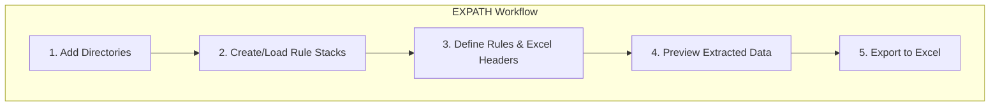

# EXPATH - A File Metadata Exporter

A cross-platform desktop application for extracting file metadata using a powerful rule-based system and exporting it to Excel.

## Overview

EXPATH is a tool designed to extract specific information from files within a directory structure. Users can define a set of rules to extract metadata such as file name, path, creation date, and more. The extracted data can then be exported to an `.xlsx` file for analysis or record-keeping.

## Features

*   **Flexible Data Extraction:** Define custom "rule stacks" to specify exactly what data to extract from each file.
*   **Customizable Excel Export:** Each rule stack corresponds to a column in the exported Excel file, with a customizable header.
*   **Live Preview:** Review the data to be exported in a table before generating the final Excel file.
*   **Save & Load Rule Stacks:** Save your rule configurations to a JSON file to reuse them across different data extraction tasks.
*   **Cross-Platform:** Built with Flutter to run on Windows, macOS, and Linux.

## How It Works

## Getting Started (For Developers)

1.  Clone the repository: `git clone <repository-url>`
2.  Install dependencies: `flutter pub get`
3.  Run the application: `flutter run`
