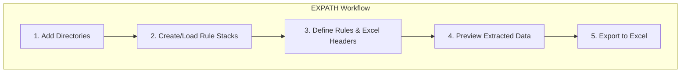

# EXPATH - User Manual

## 1. Introduction

Welcome to EXPATH!

EXPATH is a powerful and flexible tool designed for extracting metadata from files and organizing it into a structured Excel format. Whether you're a data analyst, a researcher, or anyone who needs to work with file-based data, EXPATH simplifies the process of gathering information like file names, paths, creation dates, and more.

With its intuitive rule-based system, you can create custom "rule stacks" to define precisely what information you want to extract. Each rule stack corresponds to a column in your final Excel spreadsheet, giving you complete control over the output.

This manual will guide you through the features and workflow of EXPATH, helping you get the most out of the application.

## 2. Getting Started

### Installation

EXPATH is a cross-platform desktop application that runs on Windows, macOS, and Linux. To get started, simply download the latest release for your operating system and run the installer.

### The Main Screen

When you first launch EXPATH, you'll be greeted by the main screen, which is divided into three key sections:

*   **Directories List (Left):** This is where you'll add the folders containing the files you want to process.
*   **Rules List (Right):** Here, you'll create and manage your "rule stacks" to define what data to extract.
*   **Action Buttons (Bottom):** These buttons allow you to preview the extracted data and export it to an Excel file.

## 3. Core Concepts

### Directories

The first step in any data extraction task is to tell EXPATH where to find your files. You can add one or more directories to the **Directories List**. EXPATH will scan these directories and all their subdirectories to find the files to process.

**To add a directory:**

1.  Click the **"Add Directory"** button.
2.  Browse to the folder you want to add and select it.

The selected directory will now appear in the list.

### Rules and Rule Stacks

The heart of EXPATH is its powerful rule-based system. You can combine multiple rules into a "rule stack" to extract and transform file metadata in a specific sequence.

*   **What is a Rule?** A rule is a single operation that extracts or modifies a piece of data. For example, the "File Name" rule extracts the name of a file, while the "Concatenation" rule can join multiple pieces of data together.
*   **What is a Rule Stack?** A rule stack is a sequence of rules that are applied in order. The output of one rule becomes the input for the next, allowing you to build complex data extraction logic. Each rule stack corresponds to a single column in the final Excel export.

#### Creating and Managing Rule Stacks

**To create a new rule stack:**

1.  Click the **"Add Rule Stack"** button in the **Rules List** section.
2.  A new, empty rule stack will be created.

**To define the Excel header for a rule stack:**

1.  Click on the rule stack in the list.
2.  In the editor that appears, enter a descriptive name in the **"Excel Header"** field. This will be the column title in your exported `.xlsx` file.

**To add a rule to a stack:**

1.  Select the rule stack you want to edit.
2.  Click the **"Add Rule"** button.
3.  Choose a rule from the dropdown list and configure its parameters.

#### Available Rules

Here is a list of the available rules and what they do:

*   **File Name:** Extracts the name of the file (e.g., `document.txt`).
*   **File Path:** Extracts the full path to the file (e.g., `C:\Users\YourName\Documents\document.txt`).
*   **File Type:** Extracts the file extension (e.g., `.txt`).
*   **File Size:** Extracts the size of the file in bytes.
*   **Created At:** Extracts the date and time the file was created.
*   **Parent Directory:** Extracts the name of the folder containing the file.
*   **Path Segment:** Extracts a specific segment of the file path, based on its position.
*   **Reverse Path Segment:** Extracts a path segment, counting from the end of the path.
*   **Concatenation:** Joins the output of a sub-rule with a custom string.
*   **Conditional:** Applies a sub-rule only if the input matches a specific condition.
*   **Lower/Upper Case:** Converts the input text to all lowercase or all uppercase.
*   **Simple Regex:** Extracts data from the input using a regular expression.

## 4. Workflow: Step-by-Step Guide

1.  **Add Directories:** Start by adding the folders containing the files you want to process.
2.  **Create/Load Rule Stacks:** Create new rule stacks or load a previously saved configuration from a JSON file.
3.  **Define Rules & Excel Headers:** For each rule stack, define the sequence of rules to extract the data you need and set a descriptive header for the Excel column.
4.  **Preview Extracted Data:** Click the **"Preview"** button to see a live preview of the data that will be exported. This is a great way to verify that your rules are working as expected before creating the final file.
5.  **Export to Excel:** Once you're satisfied with the preview, click the **"Export"** button to generate the `.xlsx` file.

## 5. Saving and Loading Rule Configurations

To save time, you can save your rule stacks to a JSON file and reuse them later.

*   **To Save:** Click the **"Save Rules"** button and choose a location to save your configuration file.
*   **To Load:** Click the **"Load Rules"** button and select a previously saved `.json` file.

## 6. Previewing Data

The **Preview** screen is an essential feature that allows you to see what your final exported data will look like. It displays a table where each row represents a file and each column corresponds to one of your rule stacks.

Use the preview to:

*   Verify that your rules are extracting the correct information.
*   Check for any errors or unexpected results.
*   Make adjustments to your rules before exporting.

## 7. Exporting Data

When you're ready to create your final spreadsheet, click the **"Export"** button. You'll be prompted to choose a name and location for your `.xlsx` file.

EXPATH will then process all the files in your selected directories and generate an Excel file based on your rule stacks.

## 8. Troubleshooting & FAQ

**Q: Why is the preview table empty?**

**A:** This could be due to a few reasons:
*   Make sure you have added at least one directory.
*   Check that your rules are configured correctly. A misconfigured rule might not produce any output.

**Q: Can I reorder the columns in the final Excel file?**

**A:** Yes, the order of the columns in the exported file is determined by the order of the rule stacks in the **Rules List**. You can reorder the rule stacks by dragging and dropping them.

---

We hope this manual helps you get the most out of EXPATH. Happy extracting!