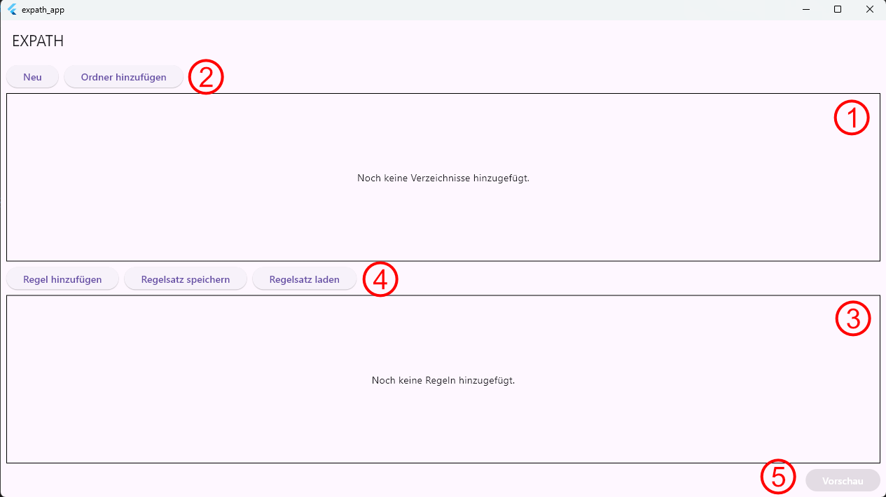

# EXPATH - Benutzerhandbuch

## 1. Einführung

Willkommen bei EXPATH!

EXPATH ist ein leistungsstarkes und flexibles Tool, das für die Extraktion von Metadaten aus Dateien und deren Organisation in einem strukturierten Excel-Format entwickelt wurde. Ob Sie Datenanalyst, Forscher oder jemand sind, der mit dateibasierten Daten arbeiten muss - EXPATH vereinfacht den Prozess der Sammlung von Informationen wie Dateinamen, Pfaden, Erstellungsdaten und mehr.

Mit seinem intuitiven regelbasierten System können Sie benutzerdefinierte "Regelstapel" erstellen, um genau zu definieren, welche Informationen Sie extrahieren möchten. Jeder Regelstapel entspricht einer Spalte in Ihrer finalen Excel-Tabelle und gibt Ihnen vollständige Kontrolle über die Ausgabe.

Dieses Handbuch führt Sie durch die Funktionen und den Arbeitsablauf von EXPATH und hilft Ihnen dabei, das Beste aus der Anwendung herauszuholen.

## 2. Erste Schritte

### Installation

EXPATH ist eine plattformübergreifende Desktop-Anwendung auf Flutter-Basis. Es können somit lauffähige Anwendungen für Windows, macOS und Linux kompiliert werden. Zielplattform für die Anwendung ist eigentlich Windows.

### Der Hauptbildschirm

Wenn Sie EXPATH zum ersten Mal starten, werden Sie vom Hauptbildschirm begrüßt, der in drei wichtige Bereiche unterteilt ist:

1. **Verzeichnisliste:** Hier werden alle Ordner angezeigt, deren Dateien (und Dateien in Unterverzeichnissen) berücksichtigt werden sollen.
2. **Verzeichnisliste-Buttons:** Mit diesen Buttons ändern Sie die Verzeichnisliste:
    - **Neu:** Das gesamte Projekt wird zurückgesetzt und startet wieder neu.
    - **Ordner hinzufügen:** Suchen Sie einen Ordner auf Ihrem PC aus, der im Import berücksichtigt werden soll.
3. **Regelstapel-Liste:** Hier erstellen und verwalten Sie Ihre "Regelstapel", um zu definieren, welche Daten extrahiert werden sollen.
4. **Regelstapel-Buttons:** Mit diesen Buttons ändern Sie die Regelstapel-Liste:
    - **Regelstapel hinzufügen:** Hiermit erstellen Sie einen neuen Regelstapel.
    - **Regelstapel-Satz speichern:** Hiermit speichern Sie den gegenwärtigen Satz an Regelstapeln.
    - **Regelstapel-Satz laden:** Hiermit laden Sie einen bereits zuvor gespeicherten Satz an Regelstaplen.
*   **Aktionsschaltflächen (Unten):** Diese Schaltflächen ermöglichen es Ihnen, die extrahierten Daten in der Vorschau anzuzeigen und in eine Excel-Datei zu exportieren.

## 3. Grundlegende Konzepte

### Verzeichnisse

Der erste Schritt bei jeder Datenextraktionsaufgabe ist es, EXPATH mitzuteilen, wo Ihre Dateien zu finden sind. Sie können ein oder mehrere Verzeichnisse zur **Verzeichnisliste** hinzufügen. EXPATH durchsucht diese Verzeichnisse und alle ihre Unterverzeichnisse, um die zu verarbeitenden Dateien zu finden.

**So fügen Sie ein Verzeichnis hinzu:**

1.  Klicken Sie auf die Schaltfläche **"Verzeichnis hinzufügen"**.
2.  Navigieren Sie zu dem Ordner, den Sie hinzufügen möchten, und wählen Sie ihn aus.

Das ausgewählte Verzeichnis erscheint nun in der Liste.

### Regeln und Regelstapel

Das Herzstück von EXPATH ist regelbasiertes System. Sie können mehrere Regeln zu einem "Regelstapel" kombinieren, um Datei-Metadaten in einer bestimmten Reihenfolge zu extrahieren und zu transformieren.

*   **Was ist eine Regel?** Eine Regel ist eine einzelne Operation, die ein Datenstück extrahiert oder modifiziert. Zum Beispiel extrahiert die "Dateiname"-Regel den Namen einer Datei, während die "Verkettung"-Regel mehrere Datenstücke zusammenfügen kann.
*   **Was ist ein Regelstapel?** Ein Regelstapel ist eine Sequenz von Regeln, die in der Reihenfolge angewendet werden. Die Ausgabe einer Regel wird zur Eingabe für die nächste, wodurch Sie komplexe Datenextraktionslogik aufbauen können. Jeder Regelstapel entspricht einer einzelnen Spalte im finalen Excel-Export. Beispielsweise könnten Sie die ersten 3 Zeichen des Dateinamens dadurch erhalten, dass Sie als erste Regel den Dateinamen extrahieren und dann als zweite Regel "Zeichen vom Start" mit dem Argument 3 definieren.

#### Erstellen und Verwalten von Regelstapeln

**So erstellen Sie einen neuen Regelstapel:**

1.  Klicken Sie auf die Schaltfläche **"Regelstapel hinzufügen"** im Bereich **Regelliste**.
2.  Ein neuer, leerer Regelstapel wird erstellt.
3.  Sie kommen automatisch auf den Regelstapel-Editor-Screen.
4.  Benennen Sie die Spalte in der Excel-Ausgabe für diesen Regelstapel.
5.  Fügen Sie dann über die Schaltflächen Regeln zum Regelstaplel hinzu.

#### Verfügbare Regeln

Hier ist eine Liste der verfügbaren Regeln und was sie tun:

*   **Dateiname:** Extrahiert den Namen der Datei (z.B. `dokument.txt`).
*   **Dateiordner:** Extrahiert den Pfad zum Ordner, in dem die Datei liegt (z.B. `C:\Users\IhrName\Dokumente`)
*   **Dateipfad:** Extrahiert den vollständigen Pfad zur Datei (z.B. `C:\Users\IhrName\Dokumente\dokument.txt`).
*   **Dateityp:** Extrahiert die Dateierweiterung (z.B. `.txt`).
*   **Dateigröße:** Extrahiert die Größe der Datei in Bytes.
*   **Erstellt am:** Extrahiert das Datum und die Uhrzeit, wann die Datei erstellt wurde.
*   **Erstellt von:** Extrahiert den Benutzer, der die Datei erstellt hat.
*   **Geändert am:** Extrahiert das Datum und die Uhrzeit, wann die Datei zuletzt verändert wurde.
*   **Geändert von:** Extrahiert den Benutzer, der die Datei zuletzt verändert hat.
*   **Pfadsegment:** Extrahiert ein bestimmtes Segment des Dateipfads basierend auf seiner Position (vom Ursprungsverzeichnis aus gezählt).
*   **Pfadsegment (umgekehrt):** Extrahiert ein Pfadsegment, gezählt vom Ende des Pfads (dem Ordner, in dem die Datei liegt).
*   **Kleinschreibung:** Konvertiert den Eingabetext in Kleinbuchstaben.
*   **Großschreibung:** Konvertiert den Eingabetext in Großbuchstaben.
*   **Verkettung:** Verbindet die Ausgabe einer Unterregel mit einer benutzerdefinierten Zeichenkette davor oder danach oder beidem.
*   **Wenn dann sonst:** *Wenn* das Ergebnis der vorherigen Regel dem eingestellten Wert entspricht, *dann* wird ein benutzerdefinierter Wert ausgegeben, ansonsten ein anderer. Beispiel: Wenn die Datei im Ordner "Patent" liegt, dann wird "P" ausgeben, sonst "X".
*   **Wenn dann ersetzen:** *Wenn* das Ergebnis der vorherigen Regel dem eingestellten Wert entspricht, *dann* wird ein benutzerdefinierter Wert ausgegeben, ansonsten das Ergebnis der vorherigen Regeln. Beispiel: Wenn die Datei im Ordner "Patent" liegt, dann wird "P" ausgeben, sonst der Name des vorherigen Ordners. In Kombination sind so auch komplexe Behandlungen im Sinne von Switch-Case-Anwendungen denkbar.
*   **Zeichen (X bis Y):** Extrahiert lediglich die Zeichen X bis Y aus dem vorherigen Ergebnis. Beispiel: Von Zeichen 2 bis 4 aus "Hallo" ergibt "all".
*   **Zeichen (vor vorne):** Extrahiert lediglich X Zeichen ab dem Beginn des vorherigen Ergebnis. Beispiel: Die ersten 3 Zeichen von "Hallo" sind "Hal".
*   **Zeichen (von hinten):** Extrahiert lediglich X Zeichen ab dem Ende des vorherigen Ergebnis. Beispiel: Die letzten 3 Zeichen von "Hallo" sind "llo".
*   **Benutzerdefinierter Regex:** Extrahiert Daten aus der Eingabe mit einem regulären Ausdruck.

## 4. Arbeitsablauf: Schritt-für-Schritt-Anleitung

1.  **Verzeichnisse hinzufügen:** Beginnen Sie damit, die Ordner hinzuzufügen, die die zu verarbeitenden Dateien enthalten.
2.  **Regelstapel erstellen/laden:** Erstellen Sie neue Regelstapel oder laden Sie eine zuvor gespeicherte Konfiguration aus einer JSON-Datei.
3.  **Regeln & Excel-Überschriften definieren:** Definieren Sie für jeden Regelstapel die Sequenz von Regeln, um die benötigten Daten zu extrahieren, und setzen Sie eine beschreibende Überschrift für die Excel-Spalte.
4.  **Extrahierte Daten in Vorschau anzeigen:** Klicken Sie auf die Schaltfläche **"Vorschau"**, um eine Live-Vorschau der Daten zu sehen, die exportiert werden. Dies ist eine großartige Möglichkeit zu überprüfen, ob Ihre Regeln wie erwartet funktionieren, bevor Sie die finale Datei erstellen.
5.  **Nach Excel exportieren:** Sobald Sie mit der Vorschau zufrieden sind, klicken Sie auf die Schaltfläche **"Exportieren"**, um die `.xlsx`-Datei zu generieren.

## 5. Speichern und Laden von Regelkonfigurationen

Um Zeit zu sparen, können Sie Ihre Regelstapel in einer JSON-Datei speichern und später wiederverwenden.

*   **Zum Speichern:** Klicken Sie auf die Schaltfläche **"Regeln speichern"** und wählen Sie einen Speicherort für Ihre Konfigurationsdatei.
*   **Zum Laden:** Klicken Sie auf die Schaltfläche **"Regeln laden"** und wählen Sie eine zuvor gespeicherte `.json`-Datei aus.

## 6. Datenvorschau

Der **Vorschau**-Bildschirm ist eine wesentliche Funktion, die es Ihnen ermöglicht zu sehen, wie Ihre finalen exportierten Daten aussehen werden. Er zeigt eine Tabelle an, in der jede Zeile eine Datei und jede Spalte einem Ihrer Regelstapel entspricht.

Verwenden Sie die Vorschau, um:

*   Zu überprüfen, ob Ihre Regeln die korrekten Informationen extrahieren.
*   Nach Fehlern oder unerwarteten Ergebnissen zu suchen.
*   Anpassungen an Ihren Regeln vor dem Export vorzunehmen.

## 7. Datenexport

Wenn Sie bereit sind, Ihre finale Tabelle zu erstellen, klicken Sie auf die Schaltfläche **"Exportieren"**. Sie werden aufgefordert, einen Namen und einen Speicherort für Ihre `.xlsx`-Datei zu wählen.

EXPATH verarbeitet dann alle Dateien in Ihren ausgewählten Verzeichnissen und generiert eine Excel-Datei basierend auf Ihren Regelstapeln.

## 8. Fehlerbehebung & FAQ

**F: Warum ist die Vorschautabelle leer?**

**A:** Dies könnte verschiedene Gründe haben:
*   Stellen Sie sicher, dass Sie mindestens ein Verzeichnis hinzugefügt haben.
*   Überprüfen Sie, ob Ihre Regeln korrekt konfiguriert sind. Eine falsch konfigurierte Regel könnte keine Ausgabe produzieren.

**F: Kann ich die Reihenfolge der Spalten in der finalen Excel-Datei ändern?**

**A:** Ja, die Reihenfolge der Spalten in der exportierten Datei wird durch die Reihenfolge der Regelstapel in der **Regelliste** bestimmt. Sie können die Regelstapel durch Ziehen und Ablegen neu anordnen.

---

Wir hoffen, dass Ihnen dieses Handbuch dabei hilft, das Beste aus EXPATH herauszuholen. Viel Erfolg beim Extrahieren!